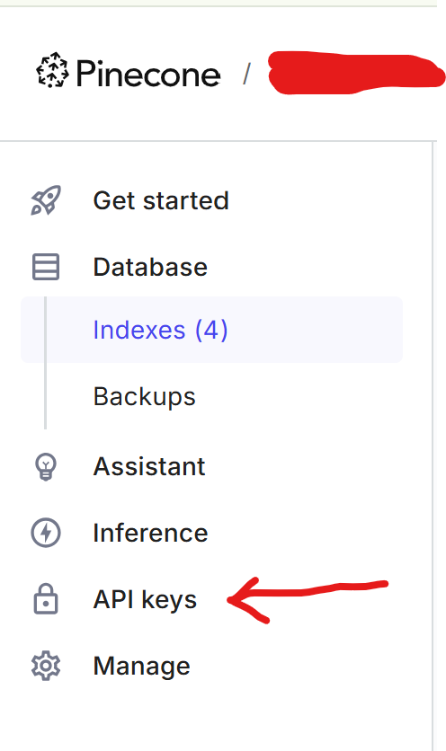

# Documentation for RAG Pipeline

Code for the RAG pipeline (Raw files (format can be txt,pdf)) --> Llamacloud --> OpenAI Embed --> pinecone)

## Overview
The RAG pipeline is a system that helps process and store documents, making it easy to search and retrieve relevant information when needed. It breaks down documents into smaller parts, organizes them in a smart database called Pinecone, and uses advanced AI technology to find and provide answers based on those documents. This guide explains how to set up and use the system step by step.

---

## Prerequisites

### Environment Setup
Ensure the following prerequisites are installed:

1. **Python version**: Python 3.8 or higher is recommended.(Python 3.10 recommended)
2. **Required Libraries**: Refer to `requirements.txt`
3. **OpenAI API Key:**

    Obtain your OpenAI API key and store it in a .env file in the root directory.
4. **Pinecone Account:**
    * Create a Pinecone account at Pinecone.io.
    * Generate an API key for your Pinecone project.
    

5. **.env variables:**
    ```bash
    OPENAI_API_KEY=your_openai_api_key
    PINECONE_API_KEY=your_pinecone_api_key
    LLAMA_CLOUD_API_KEY=your_llama_cloud_api_key
### Detailed Steps for Pinecone Setup
1. **Log in to Pinecone:**
    * Navigate to Pinecone.
    * Use admin credentials to log in.
2. **Create a New Index:**
    * Click Create Index.
    * Provide a Name (e.g., `ragimplementation-demo-index`).
    * Under Configuration, select text-embedding-ada-002.
    * Leave metric as `cosine`
    * Click Create Index.
3. **Get the API Key:**
    * From the left menu, click API Key.
    * Copy the API key and store it securely.
---
## Implementation of RAG pipeline

### 1. parsing_kb_rag
* **Purpose** : The tool converts different types of documents (like PDFs and text files) into a simpler format called Markdown (.md) for easier use and processing

* **Key Features**:
    * **Read Documents**: It looks for files in a specific folder.
    * **Converts Content**: It organizes the content into a neat Markdown format, making it easier to work with.
* **Setup**:
    1. Make two folders at root level. one is input_docs and another is parsed_docs
    2. **Add the files**: Place the documents you want to process into input_docs folder.
    3. **Set the folder path**: Update the file paths in the program to match where your documents are stored.
    4.  Using llama parse to parse the input files
    ```bash
    input_raw_file_dir = "./input_docs"  # Directory containing documents
    output_raw_file_dir = "./parsed_docs"  # Directory to store markdown files
  
---

## **2. rag_pinecone.ipynb**

### **Purpose**
This notebook is responsible for processing parsed markdown files, generating embeddings, and uploading them to a Pinecone vector database. It enables efficient retrieval-augmented generation (RAG) by structuring and storing knowledge in a vectorized format.

### **Key Features**
- **Reads parsed markdown files** from the output directory of `parsing_kb_rag.ipynb`.
- **Splits content into smaller, meaningful chunks** optimized for embedding and retrieval.
- **Generates embeddings** using the `text-embedding-ada-002` model.
- **Uploads embeddings to a Pinecone database** under a specified namespace for organized storage.

### **Setup Instructions**
1. **Specify the input directory** containing parsed markdown files:
    ```python
    input_parsed_file_dir = "./parsed_docs"  # Directory with parsed markdown files
    ```
2. **Authenticate with Pinecone** using admin credentials.
3. **Create an index in Pinecone** with the following configuration:
    - **Index Name:** Choose a name relevant to your project (e.g., `as per the need`).
    - **Embedding Model:** `text-embedding-ada-002`.
    - **Namespace:** Assign a namespace for structured storage (e.g., `as per the need`).

This setup ensures that your markdown content is effectively chunked, vectorized, and indexed for seamless retrieval.

---
## **3. get_value_rag.ipynb**

### **Purpose**
This notebook is designed to query the Pinecone database and generate responses based on retrieved document chunks. It serves as a testing and evaluation tool for retrieval-augmented generation (RAG) performance.

### **Key Features**
- **Retrieves relevant document chunks** from the Pinecone vector database using similarity search.
- **Generates responses using the ChatOpenAI model** (`gpt-4o-mini`).
- **Utilizes a LangChain prompt template** to structure queries effectively.
- **Filters results based on similarity thresholds** to ensure high-quality and contextually accurate responses.

### **Setup Instructions**
1. **Configure environment variables**:
   - Store your OpenAI API key and other necessary credentials in a `.env` file.
2. **Update Pinecone index and namespace** in the notebook:
   ```python
   index_name = "<put your index name here which was used in rag_pinecone>"
   namespace = "<put your namespace name here which was used in rag_pinecone>"
   ```

### **Workflow**
1. **Define queries** in a list within the notebook.
2. **Retrieve relevant chunks** using Pinecone’s similarity search.
3. **Filter results** based on a similarity threshold to eliminate low-relevance data.
4. **Generate responses** by passing the retrieved context and query to the LLM.

This setup ensures accurate, context-aware responses by leveraging vector-based retrieval and OpenAI’s language model.